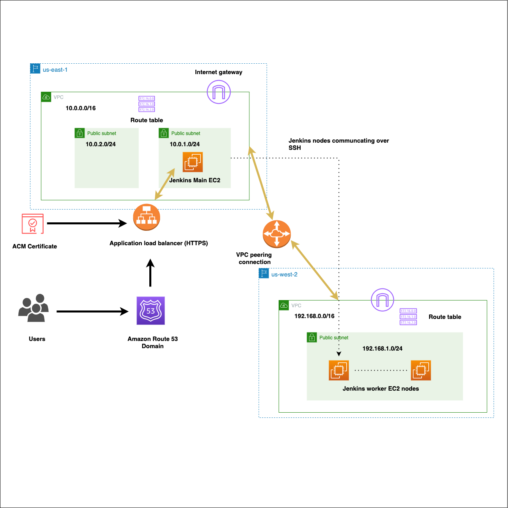

## TerraformとAnsibleを用いて、VPC peeringを行った別リージョンにJenkins workerを複数立ち上げてデプロイする


`以下の構成図に沿って、構築を行いました`





## 環境構築

```

Ansible, Terraform, AWS CLIをローカル環境で、事前に使えるようにしています

```

## 以下の手順に沿って、構築を行います


```

1. ACMで使用するドメインを取得し、variables.tfの"dns-name"のdefaultに記載する
2. aws s3api create-bucket --bucket [your unique bucket name]を実行、構築し、backend.tfの bucket に [your unique bucket name]を記載する
3. terraform init → terraform fmt → terraform validate → terraform plan → teraform applyの順にコマンドを実行する
4. 1で設定したURLにアクセスし、Jenkinsの管理画面からmasterとworkerができていることを確認する

```


## オプション


```

1. variables.tfのworkers-countのdefaultの数値を変更する
2. terraform aaplyし、先程開いたJenkinsの画面をリロードし、設定した通りにworkerの数が増えているかを確認する

```